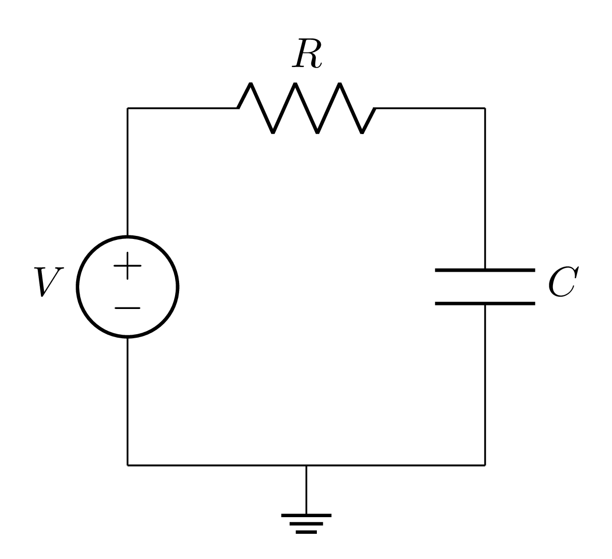

Solutions
=========

This software can calculate the following solutions for any given circuit:

- :ref:`Currents <component_currents>` and :ref:`voltage drops <component_voltages>` for each component
- Voltages for :ref:`each nodes <node_voltages>`
- State equations, both in :ref:`differential <differential-equations>` and :ref:`difference <difference-equations>` form

Component and node values
-------------------------

These are values that are calculate for every single circuit, regardless of their contents.

Do be warned that the way capacitors and inductors is :ref:`different than you might expect <capacitors_and_inductors>`.
Basically, the capacitor voltages and inductor currents will appear as literal values in the solutions in the circuit
(including for the :ref:`state equations <state-equations>`).

.. _component_currents:

Component currents
++++++++++++++++++

This software is able to find the current through each component in the circuit. When printing the values (through the
:ref:`command line interface <cli-help>` and :meth:`print_currents <rtds_circuit_analysis.Circuit.print_currents>`)
current sources and inductors are ignored (since their values are trivial).

Examples of what the software might print for each circuit:

----

.. grid:: 2
    :gutter: 2

    .. grid-item::

        .. image:: _static/current_1.png
            :alt: Circuit with current source

    .. grid-item::
        :child-align: center

        .. rubric:: Netlist:

        .. parsed-literal::

            **I1 IN 0 1m
            R1 IN OUT 6k
            R2 OUT 0 4k**

        .. rubric:: Currents:

        .. parsed-literal::

            **R1 --> 1/1000
            R2 --> 1/1000**

----

.. grid:: 2
    :gutter: 2

    .. grid-item::
        :child-align: center

        .. image:: _static/rlc_circuit.png
            :alt: RLC Circuit

    .. grid-item::
        :child-align: center

        .. rubric:: Netlist:
            
        .. parsed-literal::

            **V1 1 0 10
            R1 1 2 1k
            L1 2 3 100m
            C1 3 0 10u**

        .. rubric:: Currents:

        .. parsed-literal::

            **V1 --> IL1
            R1 --> IL1
            C1 --> IL1**

----

.. _component_voltages:

Component voltages
++++++++++++++++++

This software is able to find the voltage drop one each component in the circuit. When printing the values (through the
:ref:`command line interface <cli-help>` and :meth:`print_component_voltages
<rtds_circuit_analysis.Circuit.print_component_voltages>`) voltage sources and capacitors are ignored (since their
values are trivial).

Examples of what the software might print for each circuit:

----

.. grid:: 2
    :gutter: 2

    .. grid-item::

        .. image:: _static/voltage_1.png
            :alt: Voltage Divisor

    .. grid-item::
        :child-align: center

        .. rubric:: Netlist:
            
        .. parsed-literal::

            **V1 IN 0 10
            R1 IN OUT 6k
            R2 OUT 0 4k**

        .. rubric:: Voltages:

        .. parsed-literal::

            **R1 --> 6
            R2 --> 4**

----

.. grid:: 2
    :gutter: 2

    .. grid-item::
        :child-align: center

        .. image:: _static/rlc_circuit.png
            :alt: RLC Circuit

    .. grid-item::
        :child-align: center

        .. rubric:: Netlist:
            
        .. parsed-literal::

            **V1 1 0 10
            R1 1 2 1k
            L1 2 3 100m
            C1 3 0 10u**

        .. rubric:: Voltages:

        .. parsed-literal::

            **R1 --> 1000*IL1
            L1 --> -1000*IL1 - VC1 + 10**

----

.. _node_voltages:

Node voltages
+++++++++++++

This software is able to find the voltage on each node in the circuit.

Examples of what the software might print for each circuit:

----

.. grid:: 2
    :gutter: 2

    .. grid-item::

        .. image:: _static/voltage_1.png
            :alt: Voltage Divisor

    .. grid-item::
        :child-align: center

        .. rubric:: Netlist:
            
        .. parsed-literal::

            **V1 IN 0 10
            R1 IN OUT 6k
            R2 OUT 0 4k**

        .. rubric:: Voltages:

        .. parsed-literal::

            **IN --> 10
            OUT --> 4**

----

.. grid:: 2
    :gutter: 2

    .. grid-item::
        :child-align: center

        .. image:: _static/rlc_circuit.png
            :alt: RLC Circuit

    .. grid-item::
        :child-align: center

        .. rubric:: Netlist:
            
        .. parsed-literal::

            **V1 1 0 10
            R1 1 2 1k
            L1 2 3 100m
            C1 3 0 10u**

        .. rubric:: Voltages:

        .. parsed-literal::

            **1 --> 10
            3 --> VC1
            2 --> 10 - 1000*IL1**

----

.. _state-equations:
   
State Equations
---------------
   
This software is able to print the state equations that describe the circuit. It uses the voltages of the capacitors,
and currents of the inductors, as the parameters for the circuit. It is able to print these equations in continuous form
(differential equations), and in discrete form (difference equations).
   
For more information on what state equations are, and how they can used to describe any system (not only circuits), read
`this Wikipedia page <https://en.wikipedia.org/wiki/State-space_representation>`_, and the chapter 3 of the book 
`Modern Control Systems, by Richard Dorf <https://www.amazon.com/Modern-Control-Systems-Global-Richard-dp-1292422378/dp/1292422378>`_. 
The state equations produced by this circuit are essentially the equation, except, the State Matrix A and Input Matrix B
are all bundled together in the form a system of equations.
   
.. math::

   \dot{x}(t) = A(t)\,x(t) + B(t)\,u(t)

.. _differential-equations:

Differential Equations
++++++++++++++++++++++

Here is how the software would print the state equations in differential form for the circuit:

.. grid:: 2
    :gutter: 2

    .. grid-item::
        :child-align: center

        .. image:: _static/rlc_circuit.png
            :alt: RLC Circuit

    .. grid-item::
        :child-align: center

        .. rubric:: Netlist:
            
        .. parsed-literal::

            **V1 1 0 10
            R1 1 2 1k
            L1 2 3 100m
            C1 3 0 10u**

        .. rubric:: State Equations:

        .. parsed-literal::

            **dIL1/dt = -10000*IL1 - 10*VC1 + 100
            dVC1/dt = 100000*IL1**

----

.. _difference-equations:
   
Difference Equations
++++++++++++++++++++
   
The state equations for the circuit can also be written in discrete form, using three methods: 
`Forward Euler <https://en.wikipedia.org/wiki/Euler_method>`_, 
`Backward Euler <https://en.wikipedia.org/wiki/Backward_Euler_method>`_, 
and the `Trapezoidal Rule <https://en.wikipedia.org/wiki/Trapezoidal_rule_(differential_equations)>`_.

For these methods, it is recommended to choose a time step, be it through the :ref:`netlist <dot_step>`, :ref:`command line
<cli-help>`, or when declaring the :class:`Circuit object <rtds_circuit_analysis.Circuit>`. It isn't strictly necessary to do so, since it will default
to a literal *Ts* in the difference equations. However, the equations for the backward and trapezoidal methods will get
too big, since there generally be terms for *Ts* squared, cubed, etc.

Forward Method
..............

Here is how the software would print the state equations in difference form, using the forward method:

.. grid:: 2
    :gutter: 2

    .. grid-item::
        :child-align: center

        .. image:: _static/rlc_circuit.png
            :alt: RLC Circuit

    .. grid-item::
        :child-align: center

        .. rubric:: Netlist:
            
        .. parsed-literal::

            **V1 1 0 10
            R1 1 2 1k
            L1 2 3 100m
            C1 3 0 10u
            .STEP 1e-4**

        .. rubric:: State Equations (forward method):

        .. parsed-literal::

            **IL1_{n} = 1/100 - VC1_{n-1}/1000
            VC1_{n} = 10*IL1_{n-1} + VC1_{n-1}**

Backward Method
...............

Here is how the software would print the state equations in difference form, using the backward method:

.. grid:: 2
    :gutter: 2

    .. grid-item::
        :child-align: center

        .. image:: _static/rlc_circuit.png
            :alt: RLC Circuit

    .. grid-item::
        :child-align: center

        .. rubric:: Netlist:
            
        .. parsed-literal::

            **V1 1 0 10
            R1 1 2 1k
            L1 2 3 100m
            C1 3 0 10u
            .STEP 1e-4**

        .. rubric:: State Equations (backward method):

        .. parsed-literal::

            **IL1_{n} = 100*IL1_{n-1}/201 - VC1_{n-1}/2010 + 1/201
            VC1_{n} = 1000*IL1_{n-1}/201 + 200*VC1_{n-1}/201 + 10/201**

Trapezoidal Method
..................

Here is how the software would print the state equations in difference form, using the trapezoidal method:

.. grid:: 2
    :gutter: 2

    .. grid-item::
        :child-align: center

        .. image:: _static/rlc_circuit.png
            :alt: RLC Circuit

    .. grid-item::
        :child-align: center

        .. rubric:: Netlist:
            
        .. parsed-literal::

            **V1 1 0 10
            R1 1 2 1k
            L1 2 3 100m
            C1 3 0 10u
            .STEP 1e-4**

        .. rubric:: State Equations (trapezoidal method):

        .. parsed-literal::

            **IL1_{n} = 199*IL1_{n-1}/601 - 2*VC1_{n-1}/3005 + 4/601
            VC1_{n} = 4000*IL1_{n-1}/601 + 599*VC1_{n-1}/601 + 20/601**

.. _capacitors_and_inductors:

About Capacitors and inductors
------------------------------

Something that may seem counter intuitive for this software, is that all the results in the circuit will depend upon the
capacitor voltages, and inductor currents. Take the circuit below for example:

This is a classic RC circuit, where, assuming the capacitor is uncharged at t=0, and the voltage input is constant, them
the current for, say, the resistor, will be:

.. math::

    I_R = \frac{V}{R} e^{-t/(RC)}

However, by using this software to solve this circuit, the calculated current for the resistor will be:

.. math::

    I_R = \frac{V - V_{C1}}{R}

(the signs in this equation might be slightly different, depending on how you wrote the nodes in the netlist, as
explained :ref:`here <passive_direction>`).

This occurs because the main goal of this software is on the resolution of the :ref:`state equations <state-equations>`,
using the energy storage voltages/currents as parameters. So, the capacitors voltages and inductor currents will always
appear in the solutions for the circuit as literal values.

This may seem useless at first, but the generated :ref:`difference equations <difference-equations>` from these state
equations can be used to simulate the circuit, not only for a constant input (as is the exponential equation shown
above), but for arbitrary inputs.

You can imagine as if each capacitor *CX* is a voltage source with value of *VCX*, and each inductor *LX* as a current
source with value *ILX*. Thats pretty much what the software does internally, in fact.
